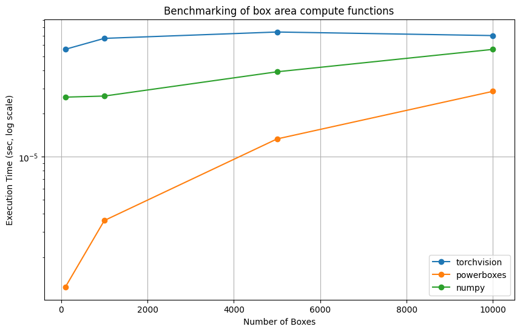
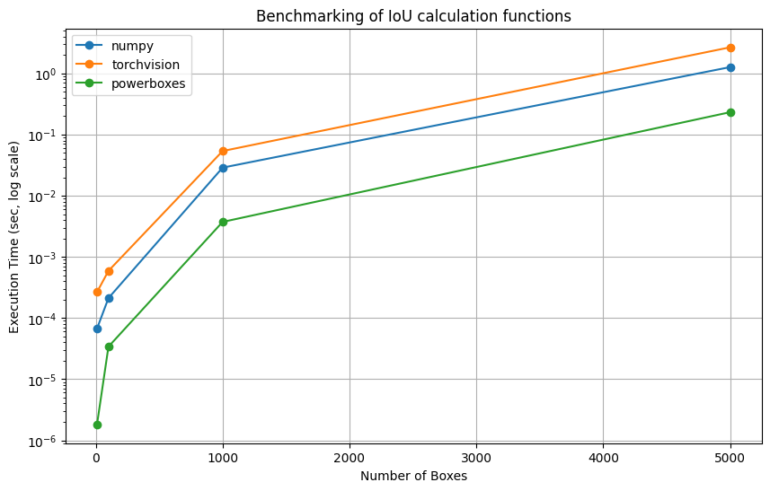
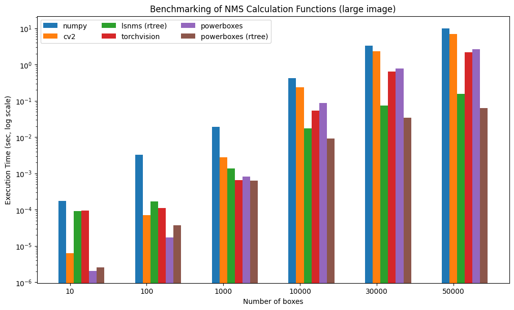
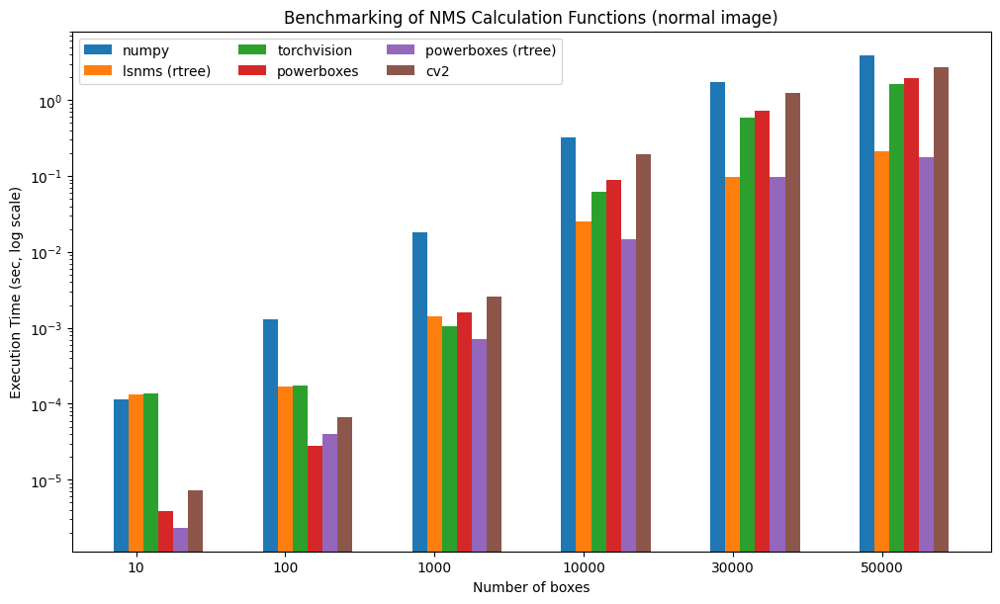

[](https://github.com/smirkey/powerboxes/actions/workflows/ci.yml)
[](https://codecov.io/gh/smirkey/powerboxes)
[](https://crates.io/crates/powerboxesrs)
[](https://pypi.python.org/pypi/powerboxes)
[](https://github.com/smirkey/powerboxes)

# <div align="center"> PowerBoxes </div>
Powerboxes is a package containing utility functions for transforming bounding boxes and computing metrics. It is implemented in both Python and Rust.
It shows a significant speedup over the equivalent numpy implementations in Python, or other libraries such as [shapely](https://github.com/shapely/shapely) or [torchvision](https://pytorch.org/vision/main/ops.html).

# Checkout out the documentation !

**🦀 Rust [documentation](https://docs.rs/powerboxesrs)**


**🐍 Python [documentation](https://smirkey.github.io/powerboxes/)**

## Installation

### Python
```bash
pip install powerboxes
```

### Rust
```bash
cargo add powerboxesrs
```

## Python Usage

```python
import powerboxes as pb
import numpy as np

# Create a bounding box
box = np.array([[0, 0, 1, 1]])

# Compute the area of the box
area = pb.box_areas(box)

# Compute the intersection of the box with itself
intersection = pb.iou_distance(box, box)

# Draw boxes on an image (CHW format, uint8)
import numpy as np
image = np.zeros((3, 100, 100), dtype=np.uint8)
boxes = np.array([[10.0, 10.0, 50.0, 50.0]])
result = pb.draw_boxes(image, boxes)
```


## Use it in Rust
All core functions use a slice-based API. ndarray wrappers are available behind the `ndarray` feature (enabled by default).

```rust
use powerboxesrs::iou::iou_distance_slice;

let boxes1 = vec![0.0, 0.0, 1.0, 1.0, 2.0, 2.0, 3.0, 3.0];
let boxes2 = vec![0.5, 0.5, 1.5, 1.5, 2.5, 2.5, 3.5, 3.5];
let iou = iou_distance_slice(&boxes1, &boxes2, 2, 2);
```


## Benchmarks

Some benchmarks of powerboxes against various open source alternatives, not all functions are benchmarked. Notice that we use log scales, **all differences are major** !
Benchmarks can be found in this google colab [notebook](https://colab.research.google.com/drive/1Z8auT4GZFbwaNs9hZfnB0kvYBbX-MOgS?usp=sharing)

### Box area
Here it's torchvision vs powerboxes vs numpy



### Box convert
Here it's torchvision vs powerboxes


### Box IoU matrix
Torchvision vs numpy vs powerboxes



### NMS
Torchvision vs powerboxes vs lsnms vs numpy

#### Large image (10000x10000 pixels)



#### Normal image (1000x1000 pixels)


