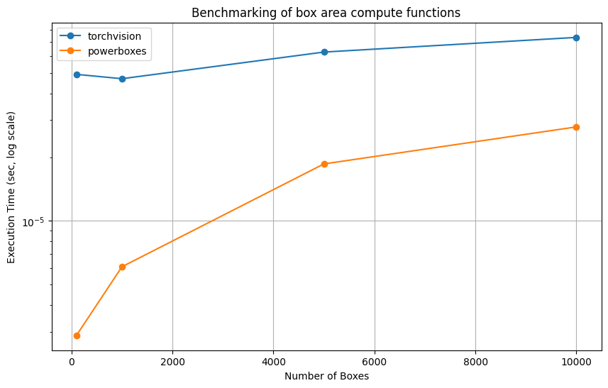
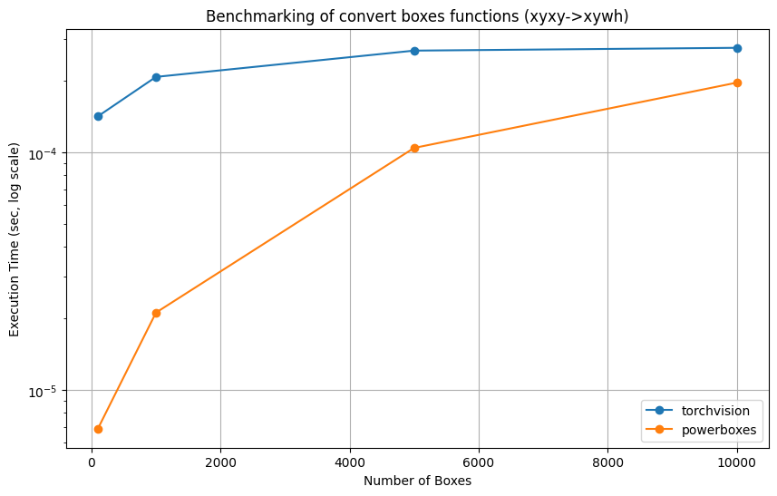
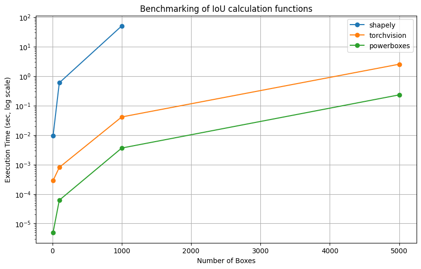
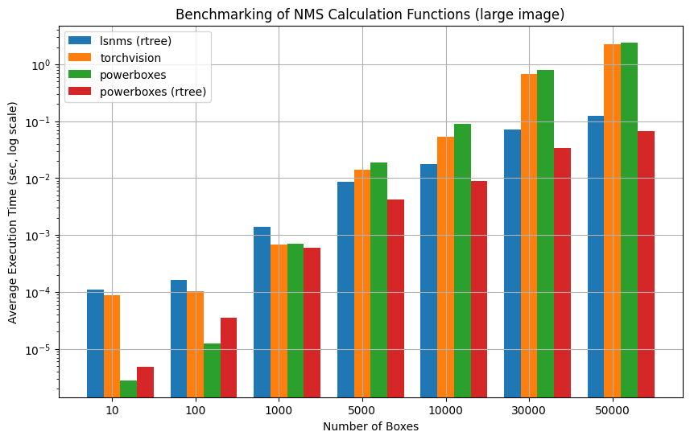
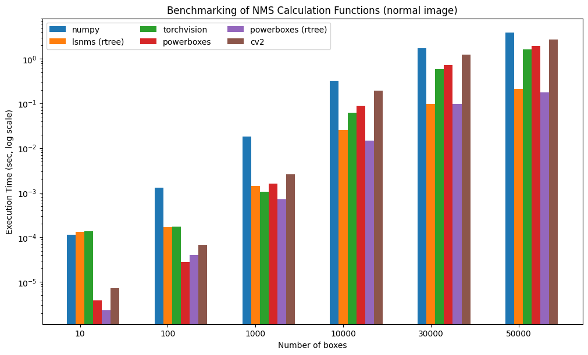

[](https://github.com/smirkey/powerboxes/actions/workflows/ci.yml)
[](https://codecov.io/gh/smirkey/powerboxes)
[](https://pypi.python.org/pypi/powerboxes)
[](https://github.com/smirkey/powerboxes)

# <div align="center"> PowerBoxes </div>
Powerboxes is a package containing utility functions for transforming bounding boxes and computing metrics. It is implemented in both Python and Rust.
It shows a significant speedup over the equivalent numpy implementations in Python, or other libraries such as [shapely](https://github.com/shapely/shapely) or [torchvision](https://pytorch.org/vision/main/ops.html).

## Installation

```bash
pip install powerboxes
```

## Python Usage

```python
import powerboxes as pb
import numpy as np

# Create a bounding box
box = np.array([[0, 0, 1, 1]])

# Compute the area of the box
area = pb.box_areas(box)

# Compute the intersection of the box with itself
intersection = pb.iou_distance(box, box)
```
### Functions available
#### Box Transformations and utilities
- `box_areas`: Compute the area of list of boxes
- `box_convert`: Convert a box from one format to another. Supported formats are `xyxy`, `xywh`, `cxcywh`.
- `remove_small_boxes`: Remove boxes with area smaller than a threshold
- `mask_to_boxes`: Convert a mask to a list of boxes

#### Box Metrics
- `iou_distance`: Compute the intersection over union matrix of two sets of boxes
- `parallel_iou_distance`: Compute the intersection over union matrix of two sets of boxes in parallel
- `giou_distance`: Compute the generalized intersection over union matrix of two sets of boxes
- `parallel_giou_distance`: Compute the generalized intersection over union matrix of two sets of boxes in parallel
- `tiou_distance`: Compute the tracking intersection over union matrix of two sets of boxes

#### Rotated Box Metrics
- `rotated_iou_distance`: Compute the intersection over union matrix of two sets of rotated boxes in cxcywha format
- `rotated_giou_distance`: Compute the generalized intersection over union matrix of two sets of rotated boxes in cxcywha format

#### Box NMS
- `nms`: Non-maximum suppression, returns the indices of the boxes to keep
- `rtree_nms`: Non-maximum suppression, returns the indices of the boxes to keep, uses a r-tree internally to avoid quadratic complexity, useful when having many boxes.

## Benchmarks

Some benchmarks of powerboxes against various open source alternatives, not all functions are benchmarked. Notice that we use log scales, **all differences are major** !

### Box area
Here it's torchvision vs powerboxes vs numpy



### Box convert
Here it's torchvision vs powerboxes



### Box IoU matrix
Torchvision vs numpy vs powerboxes



### NMS
Torchvision vs powerboxes vs lsnms vs numpy

#### Large image (10000x10000 pixels)



#### Normal image (1000x1000 pixels)

