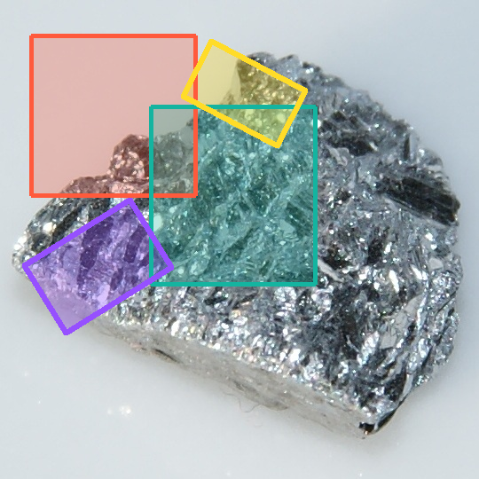

::: powerboxes.draw_boxes

`draw_boxes` draws axis-aligned `xyxy` boxes on CHW `uint8` images.

## Axis-Aligned Example

```python
import numpy as np
import powerboxes as pb

image = np.zeros((3, 100, 100), dtype=np.uint8)
boxes = np.array(
    [
        [10.0, 10.0, 50.0, 50.0],
        [20.0, 20.0, 80.0, 70.0],
    ]
)

outlined = pb.draw_boxes(image, boxes)
filled = pb.draw_boxes(image, boxes, filled=True, opacity=0.35)
```

## Rotated Boxes

::: powerboxes.draw_rotated_boxes

`draw_rotated_boxes` draws `cxcywha` boxes using general line rasterization, so non-axis-aligned edges render correctly.

```python
import numpy as np
import powerboxes as pb

image = np.zeros((3, 100, 100), dtype=np.uint8)
rotated_boxes = np.array(
    [
        [50.0, 50.0, 30.0, 20.0, 30.0],
        [60.0, 35.0, 20.0, 10.0, -20.0],
    ]
)

result = pb.draw_rotated_boxes(image, rotated_boxes, filled=True, opacity=0.4)
```

## Notes

- Images use CHW layout: `(3, H, W)`.
- `colors` must have shape `(N, 3)` when provided.
- `opacity` must be in the closed interval `[0.0, 1.0]`.


